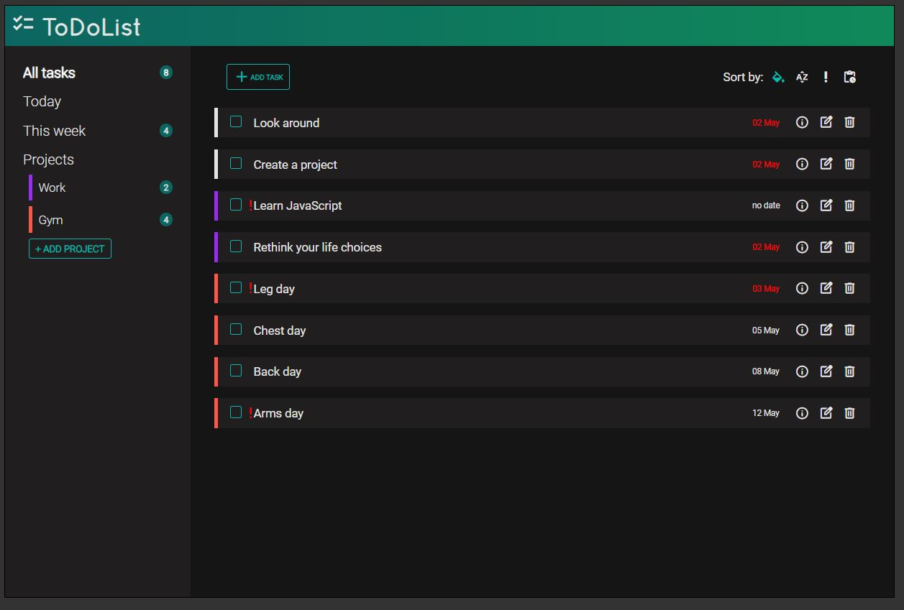

# Vanilla JS TODO

### **Description**

An application for tracking tasks built with Vanilla Js rendering.

#### 🔗 [Live preview](https://dimar1510.github.io/todo/)

### **Features**

- Create/edit/delete your tasks
- Create projects with color coding and assign your tasks to them
- Group and sort your tasks by dates, categories or importance

### **Built With**

- TypeScript
- SCSS
- Webpack

